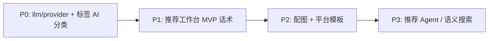

# Project Pilot — AI 与 Agent 接入分析

> 文档版本：**v2.0**（产品方向修订）  
> 更新日期：2026-06-02  
> 关联文档：[PROJECT_PILOT_v0.1_设计文档.md](./PROJECT_PILOT_v0.1_设计文档.md)、[PROJECT_PILOT_Implementation_Plan.md](./PROJECT_PILOT_Implementation_Plan.md)、[GithubStarsManager_竞品分析报告.md](./GithubStarsManager_竞品分析报告.md)、[RedBox_分析报告.md](./RedBox_分析报告.md)、[AGENTS.md](../AGENTS.md)

---

## 1. 文档目的与 v2 修订说明

### 1.1 本文回答什么

1. **Project Pilot 的 AI 战略是什么？** — 哪些做、哪些不做、与外链工具如何分工。  
2. **近期第一优先：标签 AI 分类** — 适合什么架构、如何分步交付。  
3. **中长期：GitHub 项目推荐工作台** — 向 RedBox「生成能力」靠拢的路径。  
4. **何时需要 Agent、何时只需单次 LLM** — 以及框架选型参考（LangChain vs pi-agent-core）。

### 1.2 v1 → v2 方向变更（2026-06-02）

| 维度 | v1（原稿） | v2（当前） |
|------|------------|------------|
| **项目理解** | 自建 LLM 读 README → `ai_summary` / 部署标签 | **外链 [Zread](https://zread.ai) / DeepWiki** 满足分析需求，**不再优先自建仓库分析** |
| **AI 第一优先** | Phase 2 AI 摘要服务 | **标签未分类整理**（~300 标签 → 归入 `tag_categories`） |
| **产品延伸** | 发现页分析、语义搜索 | **推荐工作台**：推荐话术、推荐配图等（参考 RedBox 创作侧） |
| **Agent 定位** | 尽早从摘要扩展到 Agent | **先单次 LLM，确认需求后再上 tool loop** |

设计文档 [§3.1 收集](./PROJECT_PILOT_v0.1_设计文档.md) 中的「AI 读取 README 生成摘要」仍作历史产品描述；**实现优先级以本文 v2 为准**。`projects.ai_summary`、`deploy_methods` 字段与 UI **保留**（手动填写 / 外链说明），但不作为 LLM 建设目标。

### 1.3 术语

| 术语 | 含义 |
|------|------|
| **LLM 任务** | 单次 Prompt → 结构化 JSON / 文本，无工具循环（如：批量标签分类、生成推荐话术）。 |
| **AI Agent** | 基于 LLM、可调用工具、多步推理（如：查资料库 → 写稿 → 生图 → 用户确认）。 |
| **AGENTS.md** | 仓库内 AI 与开发者协作约定，**与产品内 LLM 无关**。 |
| **机器翻译** | Google 翻译 Provider，**不是 LLM**，继续用于简介 / README。 |
| **项目理解外链** | 详情 / 发现卡片上的 Zread、DeepWiki 等，替代自建 README 分析。 |

---

## 2. 产品模块与 AI 分工

### 2.1 总体模块图

```
Project Pilot
├── 资料库 / 发现 / 看板          ← 已有；管理 + 探索
├── 项目理解                      ← 外链 Zread / DeepWiki（非 LLM）
├── 标签体系                      ← 【近期 AI】未分类标签批量归类
└── 推荐工作台（新模块，规划中）   ← 【中期 AI】话术 + 配图；长期向 RedBox 创作能力靠拢
```

### 2.2 痛点与手段（修订后）

| 痛点 | 手段 | 是否 LLM |
|------|------|----------|
| **P1 信息碎片化** | GitHub enrich + 外链 Wiki 读 README | 否（外链） |
| **P2 部署方式混乱** | 手动部署日志、笔记；暂不 AI 解析 | 可选，低优先 |
| **P3 分类混乱** | 文件夹 + 领域标签；**AI 整理未分类标签** | **是（近期 P0）** |
| **P4 体验 / 推荐表达** | **推荐工作台**生成话术与配图 | **是（中期 P1）** |

### 2.3 竞品参考（学习路径，非照搬）

| 项目 | 与 Project Pilot 关系 | 建议学什么 |
|------|----------------------|------------|
| **GithubStarsManager** | 同为 GitHub 项目管理 | `AIService` 单次 LLM、`AIConfigPanel` 设置、JSON 结构化输出 → **用于标签分类、话术生成** |
| **RedBox** | 创作 / Agent 平台 | 多 Provider 配置、图像适配器、tool loop → **用于推荐工作台阶段 2+**；**标签整理用不到 Agent** |

RedBox 路径：`Electron 主进程` 承担全部 AI；Project Pilot 应 **`FastAPI 后端` 统一调 LLM**，前端只 REST / SSE，**不要**学 GithubStarsManager 把 AIService 放浏览器。

---

## 3. 当前项目的 AI 相关现状

### 3.1 能力矩阵

| 能力 | 状态 | 技术 | 说明 |
|------|------|------|------|
| 简介 / README **机器翻译** | ✅ | Google Provider | `POST /api/projects/{id}/translate`、`/api/translation/translate-text` |
| 发现页临时翻译 | ✅ | 同上 | 不落库 |
| 主题探索 query 扩展 | ✅ | 机器翻译 → GitHub Search | `discovery_topic_query.py` |
| GitHub enrich | ✅ | REST API | Stars、topics、description 等 |
| **Zread 外链** | ✅ | URL 拼接 | 发现 / 详情 |
| **DeepWiki 外链** | 可选 | 英文仓库 | 竞品有，可按语言二选一 |
| **`ai_summary` / `deploy_methods`** | ⚠️ 字段 + UI | 无生成流水线 | **降为手动 / 外链补充，非 LLM 目标** |
| **LLM Provider + 设置页** | ❌ | — | 标签整理与推荐工作台的前置 |
| **标签 AI 分类** | ❌ | — | **近期 P0** |
| **推荐工作台** | ❌ | — | 中期 P1 |
| Agent 对话 / 语义搜索 | ❌ | — | 长期 P2+ |

### 3.2 标签模型（与 AI 任务直接相关）

已有 schema，**无需为 AI 改表**：

- `tag_categories` — 用户自定义分类（`project_library_id` scoped）
- `tags.category_id` — `NULL` 表示 **未分类**
- `PATCH /api/project-libraries/{id}/tags/{tag_id}` — 已支持更新 `category_id`
- 前端 [`tag-management.tsx`](../frontend/src/pages/library/tag-management.tsx) — 拖拽归类、批量选择、`onBatchMove`

AI 任务输出应直接映射为 `{ tag_id, category_id }` 或 `{ tag_id, new_category_name }`，经用户确认后 PATCH。

### 3.3 推荐技术分层（共用基础设施）

```
┌─────────────────────────────────────────────────────────────┐
│  frontend/ — 触发、预览、确认；推荐工作台 UI（后续）            │
└──────────────────────────┬──────────────────────────────────┘
                           │ REST（可选 SSE）
┌──────────────────────────▼──────────────────────────────────┐
│  backend/app/api/                                            │
│  · settings/ai          ← 新建                               │
│  · tags/suggest-categories、apply-category-suggestions       │
│  · recommend/…          ← 推荐工作台（后续）                  │
└──────────────────────────┬──────────────────────────────────┘
                           │
┌──────────────────────────▼──────────────────────────────────┐
│  backend/app/services/                                       │
│  · llm/provider.py      ← 仿 translation/provider.py         │
│  · tag_category_suggest.py                                   │
│  · recommend_copy.py / image_provider.py  ← 后续             │
│  · ai_agent/            ← 仅阶段 4+ 需要                     │
└──────────────────────────┬──────────────────────────────────┘
                           │
┌──────────────────────────▼──────────────────────────────────┐
│  SQLite — app_settings（Key）、tags、tag_categories、草稿表   │
└─────────────────────────────────────────────────────────────┘
```

**可复用要点：**

1. **Provider 抽象** — 对齐 `translation/provider.py` + `settings_translation.py`。  
2. **契约优先** — 新 API 同步 [`contracts/openapi.json`](../contracts/openapi.json)。  
3. **人工确认再写入** — 批量标签、推荐话术均 **预览 → 用户勾选 → apply**，避免 LLM 幻觉一次污染 300 条数据。  
4. **桌面 sidecar** — 与 Web 共用同一 FastAPI，无第二套 AI 逻辑。

### 3.4 与「翻译」的边界

| 维度 | 机器翻译（保持） | LLM（新建） |
|------|------------------|-------------|
| 用途 | 英 → 中文可读 | 归类、创作、推理 |
| 成本 | 低，无 Key | 用户自备 Key / Ollama |
| 设置 | `/settings#translation` | `/settings#ai` |

---

## 4. 近期 P0：标签 AI 分类

### 4.1 任务特征

- **输入**：当前库下 `category_id IS NULL` 的标签（约 300 个）+ 已有 `tag_categories` 列表。  
- **输出**：每个 tag → 建议 `category_id`，或「新建分类 XXX」+ `confidence` + 可选 `reason`。  
- **性质**：批量、结构化、**无多轮对话、无 GitHub 调用** → **单次 LLM，不是 Agent**。

### 4.2 推荐 API

| 端点 | 说明 |
|------|------|
| `GET/PUT /api/settings/ai` | provider、base_url、model、has_api_key |
| `POST /api/settings/ai/test` | 连通性测试 |
| `POST .../tags/suggest-categories` | body 可选：`tag_ids`、`include_new_categories`；返回 `proposals[]` |
| `POST .../tags/apply-category-suggestions` | 用户确认后的批量写入 |

### 4.3 后端流程

```
1. SELECT tags WHERE category_id IS NULL AND project_library_id = ?
2. SELECT tag_categories WHERE project_library_id = ?
3. （可选）对每个 tag 取 1～2 个关联项目的 description 作上下文
4. 分批调用 LLM（每批 50～80 个 tag，防超 context）
5. Pydantic 解析 proposals
6. 返回前端预览（不自动 commit）
7. apply：PATCH category_id；必要时 POST tag-categories
```

### 4.4 结构化输出示例

```json
{
  "proposals": [
    {
      "tag_id": 42,
      "tag_name": "docker",
      "category_id": 3,
      "new_category_name": null,
      "confidence": "high",
      "reason": "容器与部署工具类"
    },
    {
      "tag_id": 99,
      "tag_name": "rag",
      "category_id": null,
      "new_category_name": "AI 应用",
      "confidence": "medium",
      "reason": "检索增强类项目常用"
    }
  ]
}
```

### 4.5 前端（标签管理页）

在 [`tag-management.tsx`](../frontend/src/pages/library/tag-management.tsx) 增加：

1. **「AI 整理未分类」** 按钮（无 Key 时引导设置）。  
2. **预览表格**：建议分类、置信度、reason；低 confidence 默认不勾选。  
3. **可编辑**：下拉改分类、取消勾选。  
4. **「应用选中」** → `apply-category-suggestions`。  
5. （可选）导出 JSON 备份、记录 apply 前 snapshot 便于撤销。

### 4.6 分三步交付（边做边改，不必一步到位）

| 步骤 | 内容 | 说明 |
|------|------|------|
| **Step 1** | `llm/provider` + `/settings/ai` + suggest（仅归入**已有**分类） | 1～2 天可交付 MVP |
| **Step 2** | 分批 + 重试；支持建议**新建分类**；低 confidence 标黄 | 提升 300 标签准确率 |
| **Step 3** | 附带关联项目 description；导出 / 撤销 | 体验与安全感 |

**Step 1 不要做的：**

- 不上 LangChain / pi-agent-core  
- 不自动 apply（必须人工确认）  
- 不与推荐工作台耦合  

### 4.7 建议目录

```
backend/app/
├── services/
│   ├── llm/
│   │   ├── provider.py
│   │   └── openai_compatible.py
│   ├── settings_ai.py
│   └── tag_category_suggest.py
├── api/
│   └── tags.py          # 或 tags_ai.py 挂载 suggest/apply
└── schemas/
    └── tag_ai.py
```

---

## 5. 中期 P1：GitHub 项目推荐工作台

### 5.1 定位

向 **RedBox 创作侧**靠拢（非其知识库 Agent）：从资料库选取已收录项目，生成 **推荐话术**、**推荐配图**，支持多平台语气与草稿历史。

**项目理解**仍靠 Zread / DeepWiki + 已有 description / 笔记，工作台 **不重复做 README 分析**。

### 5.2 能力分期

| 阶段 | 能力 | 技术形态 | 参考 |
|------|------|----------|------|
| **1 — MVP** | 选项目 → 模板 prompt → LLM 话术 → 编辑 → 存草稿 | 单次 LLM | GithubStarsManager 分析 prompt 结构 |
| **2 — 配图** | 话术 + 项目元数据 → 图像 API | 图像 Provider 适配器 | RedBox `imageProviderAdapters.ts` |
| **3 — 工作流** | 多版本、平台预设（微博 / 公众号 / X） | 模板 + SQLite 草稿表 | — |
| **4 — Agent** | 多步：查库 → 写稿 → 生图 → 确认 | tool loop（可选 pi-agent 思路） | RedBox `PiChatService` |

阶段 1～3 **均不需要 Agent**；阶段 4 再评估手写 tool loop 是否足够。

### 5.3 数据模型（草案）

新表建议 scoped 到 `project_library_id` 或用户级：

- `recommend_drafts` — `project_id`、话术正文、平台、版本、`created_at`  
- （可选）`recommend_assets` — 配图 URL / 本地路径、关联 draft_id  

路由示例：`/recommend` 或 `/workbench` 独立资源，与 `/projects` 解耦。

### 5.4 API sketch（阶段 1）

| 端点 | 用途 |
|------|------|
| `POST /api/recommend/drafts` | 创建草稿（关联 project_id） |
| `POST /api/recommend/drafts/{id}/generate-copy` | LLM 生成话术 |
| `PATCH /api/recommend/drafts/{id}` | 用户编辑 |
| `POST /api/recommend/drafts/{id}/generate-image` | 阶段 2：配图 |

### 5.5 与资料库的关系

```
资料库选中项目 ──→ 内容工厂 / 项目推广（/libraries/:id/content-factory/project-promotion）
                      ├── 平台话术生成（P1 已交付）
                      ├── 封面 Tab：README 截图 + AI 出图（Phase 1，2026-06-17）
                      ├── 风格库弹窗：cover-styles CRUD / AI 风格（Phase 2，2026-06-22）
                      └── 左侧草稿库列表
```

功能区最左轨 **「内容工厂」** 图标（P1 已交付），与「资料库 / 发现 / 看板」并列。

**Phase 2 风格库（2026-06-22）**：`recommend_cover_style` 文本 LLM 单次生成风格 JSON + `cover_styles` SQLite；**非 Agent**。参考图 vision 分析仍属规划。见 [内容工厂 AI 封面融合方案 §8](./PROJECT_PILOT_内容工厂_AI封面与视觉导演融合方案.md) 与 [CHANGELOG_2026-06-22](../changelogs/CHANGELOG_2026-06-22.md)。

---

## 6. LLM vs Agent：如何选择

| 场景 | 形态 | 阶段 |
|------|------|------|
| 300 标签批量归类 | **单次 LLM + JSON** | **现在** |
| 推荐话术生成 | **单次 LLM + 模板** | 中期 |
| 推荐配图 | **图像 API**（非 Agent） | 中期 |
| 「帮我从库里挑 3 个项目写对比推荐」 | **Agent + DB tools** | 长期 |
| 资料库自然语言搜索 | LLM 扩词 + 本地匹配，或 + embedding | 长期 |
| 简介 / README 翻译 | **机器翻译**（保持） | 已有 |
| README 项目分析 | **Zread / DeepWiki 外链**（不做 LLM） | 战略放弃 |

**结论：** 共用 `services/llm/provider.py` 即可；**只有阶段 4 推荐工作台** 才值得引入 `ai_agent/runner.py`。标签整理 **永远不需要 Agent**。

---

## 7. 框架参考：LangChain vs pi-agent-core（RedBox 迁移）

RedBox 已从 **LangChain / LangGraph** 迁至 **pi-agent-core**。对 Project Pilot 的启示如下（**不要求照搬 RedBox 栈**）。

| 维度 | LangChain / LangGraph | pi-agent-core（RedBox 现用） |
|------|----------------------|------------------------------|
| 定位 | 通用 LLM 应用全家桶 | 轻量 **Agent 运行时**（tool loop + 流式） |
| 抽象 | Chain、Retriever、Memory 多层 | Model + Tools + 循环，接近手写 Agent |
| 依赖 | 较重，升级牵连面大 | 较轻；RedBox 仍保留自研 `QueryRuntime` |
| 适用 | 快速 RAG demo、标准 Agent 教程 | 桌面长会话、多工具、流式 IPC、精细控 token |

**RedBox 迁移的实际收益：**

1. 与 Electron 流式 UI / 工具确认流对齐，少与框架「打架」。  
2. Skills、MCP、子代理等自定义多，轻量运行时更易控。  
3. 去掉未使用的 `@ai-sdk/*` 等依赖，减少体积与认知负担。

**Project Pilot 建议：**

| 任务 | 框架 |
|------|------|
| 标签分类、推荐话术 | **无框架**，`openai` SDK + Pydantic |
| 未来推荐 Agent | **手写 tool loop**（仿 RedBox `queryRuntime.ts` 思路）或评估 Pydantic AI |
| LangChain / pi-agent-core | **现阶段均不引入**；pi-agent-core 偏 Node/Electron，与 FastAPI 栈不匹配 |

---

## 8. 实施路线图（修订优先级）



| 优先级 | 交付物 | 备注 |
|--------|--------|------|
| **P0** | `/settings/ai`、`suggest-categories`、标签管理预览 UI | 共用 LLM 基础设施 |
| **P0** | 文档：弱化 `ai_summary` LLM 路线；强调 Zread/DeepWiki | 与设计文档对齐说明 |
| **P1** | 推荐工作台路由 + 话术生成 + 草稿表 | 单次 LLM |
| **P2** | 图像 Provider + 配图生成 | |
| **P3** | 可选 Agent、语义搜索 | 视需求再定 |

### 8.1 架构转化是否容易？

| 投资 | 标签整理 | 推荐工作台 | 未来 Agent |
|------|----------|------------|------------|
| `llm/provider` + `/settings/ai` | ✅ 需要 | ✅ 复用 | ✅ 复用 |
| `tag_category_suggest.py` | ✅ | — | — |
| `recommend_*` 服务 | — | ✅ | 可扩展 tools |
| `ai_agent/runner` | ❌ | ❌ 阶段 1～3 不需要 | 可选叠加 |

**转化成本低：** 先建 LLM 层，按 **消费者** 增量添加 service，无需推翻重来。

---

## 9. 接入检查清单

### 9.1 标签 AI 分类（P0）

1. [ ] `backend/app/services/llm/` + `settings_ai.py` + `tag_category_suggest.py`  
2. [ ] `GET/PUT/POST /api/settings/ai`  
3. [ ] `POST .../tags/suggest-categories`、`POST .../tags/apply-category-suggestions`  
4. [ ] `python scripts/export_openapi.py` → 提交 `contracts/openapi.json`  
5. [ ] 标签管理页：预览 + 确认 UI  
6. [ ] 测试：无 Key 降级、分批、非法 category_id、apply 幂等  
7. [ ] [`changelogs/CHANGELOG_YYYY-MM-DD.md`](../changelogs/README.md)

### 9.2 推荐工作台（P1，后续）

1. [ ] 草稿表 migration + CRUD API  
2. [ ] `generate-copy` + 前端工作台页  
3. [ ] 功能区入口与路由  

---

## 10. 风险与对策

| 风险 | 对策 |
|------|------|
| 标签错分批量污染 | **必须预览 + 勾选**；低 confidence 默认不选；可选 snapshot 撤销 |
| LLM 与翻译混淆 | UI 区分：翻译 Sparkles vs AI 整理 / 推荐 Wand 或 Bot 图标 |
| Token 成本（300 标签） | 分批；仅 tag 名 + 分类列表；可选附带短 description |
| 推荐话术幻觉 | 标注「AI 生成」；可编辑；可引用 Zread 链接供读者自查 |
| 隐私 | Ollama / 本地 OpenAI 兼容网关；设置页说明发送字段 |
| 产品文档不一致 | v0.1 设计文档 §3.1 AI 摘要作历史描述；以本文 + README 为准 |

---

## 11. 总结

### 11.1 战略一句话

**项目理解交给 Zread / DeepWiki 外链；LLM 优先做标签整理与推荐创作；共用后端 `llm/provider`，先单次调用、人工确认，推荐工作台成熟后再考虑 Agent。**

### 11.2 当前 AI 接入角度一览（v2）

| 角度 | 手段 | 成熟度 | 优先级 |
|------|------|--------|--------|
| 机器翻译 | Google Provider | **生产可用** | 维护 |
| 主题探索 query 扩展 | 机器翻译 | **生产可用** | 维护 |
| GitHub enrich | REST | **生产可用** | 维护 |
| 项目理解 | **Zread / DeepWiki 外链** | **生产可用** | 增强外链即可 |
| **标签 AI 分类** | 批量 LLM | **待建设** | **P0** |
| **推荐话术 / 配图** | LLM + 图像 API | **待建设** | **P1–P2** |
| `ai_summary` LLM 生成 | — | **战略放弃** | — |
| Agent / 语义搜索 | tool loop | **规划中** | **P3** |

---

## 12. 决策记录

| 日期 | 决策 | 理由 |
|------|------|------|
| 2026-06-02 | 不做自建 README / 仓库 LLM 分析 | Zread、DeepWiki 已满足理解需求，避免重复建设 |
| 2026-06-02 | AI 近期优先：标签未分类整理 | 300+ 未分类标签是真实痛点；schema 与 UI 已就绪 |
| 2026-06-02 | 中期新增推荐工作台 | 产品向 RedBox「生成能力」延伸，而非分析能力 |
| 2026-06-02 | 先单次 LLM，后 Agent | 标签与话术均不需 tool loop；降低架构风险 |
| 2026-06-02 | 不引入 LangChain；暂不引入 pi-agent-core | FastAPI 栈用轻量 SDK + 可选手写 loop 即可 |

---

*具体接口命名与字段以实现阶段 OpenAPI 为准。v1 内容中「AI 摘要 P0」等表述已被 v2 取代，请勿按 v1 排期执行。*
