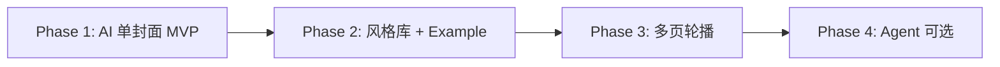

# Project Pilot — 内容工厂 AI 封面与视觉导演融合方案

> 文档版本：**v1.8**  
> 更新日期：2026-06-22  
> 外部参考：[xhs-visual-director-skill](https://github.com/ziguishian/xhs-visual-director-skill)（MIT）  
> 关联文档：[PROJECT_PILOT_AI_Agent_接入分析.md](./PROJECT_PILOT_AI_Agent_接入分析.md)、[RedBox_分析报告.md](./RedBox_分析报告.md)、[PROJECT_PILOT_v0.1_设计文档.md](./PROJECT_PILOT_v0.1_设计文档.md)、[AGENTS.md](../AGENTS.md)

---

## 1. 文档目的

本文回答三类问题，并给出可执行的分期路径：

1. **内容工厂封面现状是什么** — 「README 首屏」与其余模板按钮的实际差异。  
2. **[xhs-visual-director-skill](https://github.com/ziguishian/xhs-visual-director-skill) 能提供什么** — 哪些能力应产品化、哪些不应照搬为 Cursor Agent。  
3. **Project Pilot 如何融合** — 架构选型、数据模型草案、内置风格映射、**AI 生成并保存自定义风格**、用户自定义风格、中文出字策略与实施阶段。

**不在本文范围：** 具体 API 实现代码、图像 Provider 适配器源码、前端组件 PR。

---

## 2. 背景与动机

内容工厂「项目推广」页封面区已有 6 个模板按钮：

| 模板 ID | 标签 | 当前状态（2026-06-22） |
|---------|------|------------------------|
| `native-readme` | README 首屏 | ✅ 浏览器 DOM 截图 → 上传 PNG → 落盘 → 下载 |
| `minimal-tech` | 极简科技 | ✅ `generate-ai-cover` + 内置 `CoverStyle`；可选风格库示例图 |
| `black-gold` | 黑金商务 | ✅ 同上 |
| `code-style` | 代码风格 | ✅ 同上 |
| `gradient` | 渐变炫彩 | ✅ 同上 |
| `geek` | 极客风 | ✅ 同上 |
| *（库内自定义）* | AI / 手工 / Fork | ✅ Phase 2：`GET .../cover-styles` 动态 chips + **风格库**弹窗 CRUD |

产品期望：

- **README 首屏**保留：真实文档感、零 API Key、与项目详情 README Tab 排版一致。  
- **其余模板**升级为：传播导向的 **AI 生成封面**，风格可扩展、可沉淀用户范例；**不限于 §7 五个内置模板**，支持 **AI 生成新风格定义并保存到风格库** 后反复使用。  
- 借鉴 xhs skill 的「视觉导演」思路：**先判断内容类型 → 再选风格 → 统一母版 → 确认图 → 最终出图**，而非普通文案助手。

---

## 3. 内容工厂封面现状（代码事实）

### 3.1 前端

- 模板列表：`frontend/src/types/content-factory.ts` → `IMAGE_TEMPLATES`。  
- 封面面板：`frontend/src/components/content-factory/promotion-image-panel.tsx`。  
- 仅 `native-readme` 时：`hasCover`、重新生成、下载可用；**AI 风格**（内置 + 库内）走 `generate-ai-cover`，切换风格 **不自动生图**（Phase 1）。  
- 主流程：`frontend/src/pages/content-factory/project-promotion.tsx` — 动态 `fetchContentFactoryCoverStyles`；模板行悬停 **「+」** 打开 **风格库**弹窗（Phase 2）。

### 3.2 后端

- 封面上传：`POST .../drafts/{draft_id}/upload-cover`（`backend/app/api/content_factory.py`）。  
- 封面存储：`backend/app/services/readme_cover_storage.py` → `backend/data/content_factory_assets/`。  
- Schema：`ContentFactoryCoverTemplate = Literal["native-readme"]`（`backend/app/schemas/content_factory.py`）— 后端类型上仅认 README 封面。  
- 上传成功时 `body_json.image_template` 强制写 `"native-readme"`。

### 3.3 已有、可复用的 AI 输入

文案生成 prompt（`backend/app/prompts/content_factory/single_project.txt`）已输出：

- `hook`、`cover_texts`、`highlight_tags`、`title_options` 等 — 可直接作为图像 prompt 规划输入。  
- 设置页 AI 场景：`recommend_image`（推荐配图 / 出图）、`recommend_cover_style`（**封面风格生成**，Phase 2 已接入）。  
- 架构文档（[§5 中期 P1](./PROJECT_PILOT_AI_Agent_接入分析.md)）已定义：**推荐配图 = LLM 生成 prompt → 图像 API → 资产关联 draft**；**风格库 = 文本 LLM 单次 JSON（非 Agent loop）**。

---

## 4. xhs-visual-director-skill 能力摘要

> 仓库：[ziguishian/xhs-visual-director-skill](https://github.com/ziguishian/xhs-visual-director-skill)  
> Skill 主体：`skill/SKILL.md`；知识库：`docs/`、`templates/`、`examples/`。

### 4.1 定位

「小红书高级图文视觉导演」— 不是文案助手，而是标准化：

- 内容定位与选题拆解  
- 风格选择与风格判断报告  
- 6–8 页图文结构、统一视觉母版  
- 逐页图像生成提示词 + 负面提示词  
- **1 张视觉确认图 → 用户确认 → 批量最终图**  
- 发布文案与自检清单  

### 4.2 核心资产（MIT，可改编进 Project Pilot）

| 资产路径 | 用途 |
|----------|------|
| `docs/style_system.md` | 24 种内置风格 + 内容类型→风格映射 + 正负向 prompt 模板 |
| `templates/image_prompt_template.md` | 结构化图像 prompt 字段 |
| `docs/anti_patterns.md` | 反廉价 AI 风、PPT 感、蓝紫渐变等 |
| `templates/visual_review_checklist.md` | 出图后自检 |
| `docs/visual_consistency_protocol.md` | 多页统一母版 |
| `templates/style_extension_template.md` | **用户扩展风格**填写模板 |
| `examples/` | 可复用决策样例（非文采展示） |

### 4.3 默认审美约束（与 Project Pilot 封面 preset 可对齐）

- 画幅：**3:4 竖版**（skill 常用 1080×1440；Project Pilot README 封面默认 **1242×1660**，比例一致）。  
- 气质：高级、杂志感、手机端可读、避免模板感。  
- 中文出字：图像模型不稳定时，优先生成「可排版底图 + 文字安全区」，后期叠加真实中文。

---

## 5. 融合原则：知识库产品化，而非 Web 内跑 Cursor Skill

| 维度 | Cursor 中使用 xhs Skill | Project Pilot 产品化 |
|------|-------------------------|----------------------|
| 运行环境 | Cursor Agent + 用户对话 | FastAPI + Web UI |
| 形态 | 多步 Agent、可读 SKILL.md | **单次 LLM** + **图像 API**（见 AI 接入分析 §6） |
| 风格库 | 仓库内 md 文件 | `backend/app/prompts/content_factory/cover/` + 可选 DB 用户风格 |
| 交付物 | 本地 png + 长文方案 | 草稿 `cover_image_path` + 可选 prompt 记录 |
| Agent loop | 内置 | **仅长期**「多项目对比图文」等场景需要 |

**结论：** 将 xhs 的 **style_system、prompt 模板、反模式、example** vendoring 进后端 prompt 体系；工作流裁剪为「封面 MVP → 风格库 → 多页轮播」。

---

## 6. 推荐架构：双路径封面 + 两段式 AI 流水线

### 6.1 双路径封面

```
                    ┌─────────────────────┐
                    │   内容工厂草稿封面    │
                    └──────────┬──────────┘
                               │
              ┌────────────────┴────────────────┐
              ▼                                 ▼
   ┌──────────────────────┐        ┌──────────────────────┐
   │ A. README 首屏        │        │ B. AI 风格封面        │
   │ native-readme         │        │ minimal-tech 等       │
   │ DOM 截图（已有）       │        │ LLM prompt + 图像 API │
   │ 零 Key、文档真实感     │        │ 传播导向、可自定义风格  │
   └──────────────────────┘        └──────────────────────┘
              │                                 │
              └────────────────┬────────────────┘
                               ▼
                    cover_image_path（统一落盘与下载）
```

### 6.2 AI 封面两段式流水线

```
┌─────────────────────────────────────────────────────────────┐
│ 阶段 A — Prompt 规划（LLM，场景 recommend_image）             │
│  输入：项目元数据 + 已生成 copy + 选定 style_id               │
│  输出：style_report（可选展示）                              │
│        image_prompt + negative_prompt                        │
│        画幅（对齐 README_COVER_SIZE_PRESETS / 默认 3:4）       │
└──────────────────────────┬──────────────────────────────────┘
                           │
┌──────────────────────────▼──────────────────────────────────┐
│ 阶段 B — 出图（Image Provider，非 Agent）                     │
│  适配 OpenAI Images / Gemini / 通义万相 / Seedream 等         │
│  → PNG → upload-cover 或专用 ai-cover 端点 → assets 目录     │
└─────────────────────────────────────────────────────────────┘
```

与 RedBox 一致（见 [RedBox 分析报告 §5.5](./RedBox_分析报告.md)）：**prompt 由 LLM 生成，图像 API 执行，资产表关联 draft_id，与文案 Agent 解耦。**

### 6.3 RootFlowAI 接入（仅 Phase B 出图）

[RootFlowAI](https://rootflowai.com/docs) 是 **OpenAI 协议兼容的中转站**。若产品决策为 **「只用 RootFlowAI 做生图、文本仍走现有 MiniMax 等供应商」**，则它**只落在阶段 B**，不替代阶段 A 的 prompt 规划，也不用于 `recommend_copy` / `tag_classification`。

#### 6.3.1 职责边界

| 环节 | 是否用 RootFlowAI | 实际配置 |
|------|-------------------|----------|
| 文案生成 | ❌ | 现有 `recommend_copy` → MiniMax 等 |
| 标签 AI 整理 | ❌ | 现有 `tag_classification` |
| **封面 prompt 规划（阶段 A）** | ❌ | 同文案供应商 LLM，或 **Phase 1 模板拼装**（见下） |
| **封面出图（阶段 B）** | ✅ | `recommend_image` 场景 → RootFlowAI |

阶段 A 与阶段 B **必须解耦**：同一草稿可以同时「MiniMax 写文案 + RootFlowAI 出图」，互不占用同一 API Key 的模型槽位。

#### 6.3.2 Phase 1 推荐路径（仅 RootFlowAI 生图）

在尚未实现「LLM 规划 image_prompt」时，可用 **§7 内置模板 → 确定性 prompt 模板** 直连 RootFlowAI，缩短首版工期：

```
用户选 minimal-tech 等模板
        │
        ▼
后端按 cover_style_id 拼装 image_prompt
（项目 name / hook / highlight_tags + 风格 prefix/negative）
        │
        ▼
POST https://api.rootflowai.com/v1/images/generations
（recommend_image 场景的 base_url / api_key / model）
        │
        ▼
解析 data[0].b64_json → save_cover_png → body_json.cover_image_path
```

后续再升级为「阶段 A LLM（仍非 RootFlowAI）→ 同一 RootFlowAI 出图端点」。

#### 6.3.3 设置页配置（`recommend_image`）

在 **设置 → AI → 场景映射** 中，**仅**将「推荐配图」绑到 RootFlowAI 供应商：

| 字段 | 建议值 |
|------|--------|
| 供应商名称 | `RootFlowAI（生图）` |
| Base URL | `https://api.rootflowai.com/v1` |
| API Key | 控制台 `sk-` 令牌（[API Key 文档](https://rootflowai.com/docs)） |
| 默认模型 | 见 §6.3.4 |
| 场景 `recommend_image` | 绑定该供应商 + 生图模型名 |

**不要**把 RootFlowAI 设为默认文本供应商，避免 Chat 模型误绑到 `recommend_copy`。

#### 6.3.4 模型与参数（RootFlowAI）

以控制台 **「Gemini 绘图」** 分组为准（[服务定价 · Gemini 绘图](https://docs.rootflowai.com/guide/pricing)）；调用前可用 `GET /v1/models` 核对可用 id。

| 用途 | 建议模型 | 备注 |
|------|----------|------|
| 封面出图 | **用户在设置中选择** | `recommend_image` 场景绑定的 model；不在产品内强制 Flash / Pro 分工 |

与 Project Pilot 画幅对齐（默认 3:4，1242×1660 逻辑比例）：

```json
{
  "model": "gemini-2.5-flash-image",
  "prompt": "<§7 风格 prefix + 项目主视觉描述>",
  "aspect_ratio": "3:4",
  "n": 1,
  "response_format": "b64_json"
}
```

Pro 模型可追加 `"resolution": "2K"`；Gemini 系列通常**只返回 `b64_json`**，与现有 `save_cover_png(bytes)` 衔接，**无需**再拉取外链 URL。

GPT Image 系（如 `gpt-image-1`）走同一端点，参数以 `size` / `quality` 为主；Phase 1 优先 Gemini 竖版参数，与 xhs 3:4 母版一致。

#### 6.3.5 后端实现锚点（Phase B）

新增 **`backend/app/services/recommend_image.py`**（名称与 AI 场景一致），职责：

1. `resolve_ai_runtime_config(db, scenario_id="recommend_image")` 读取 base_url、api_key、model。  
2. `POST {base_url}/images/generations`，请求体按 §6.3.4。  
3. 解码 `b64_json` → 调用现有 `save_cover_png()`（`readme_cover_storage.py`）。  
4. 写入 `body_json`：`cover_source: "ai_generated"`、`cover_style_id`、`cover_prompt_record`（见 §9），**不再**强制 `image_template = "native-readme"`（与当前 `upload-cover` 行为区分，见 §6.3.6）。

API 入口对齐 §11：`POST .../generate-ai-cover`；预览与落盘可合并为一步（`preview_only` 时仅返回临时 URL，不写 path）。

#### 6.3.6 与 README 截图路径的差异

| 项 | README 路径 (`native-readme`) | AI + RootFlowAI |
|----|--------------------------------|-----------------|
| 触发 | 前端 DOM 截图 → `upload-cover` | 后端 `generate-ai-cover` |
| `cover_readme_sha` | 有，用于缓存 | 可省略或置空 |
| `image_template` | 固定 `native-readme` | 保留用户选的 `minimal-tech` 等 |
| `cover_source` | `readme_capture` | `ai_generated` |
| Key 要求 | 无 | 需配置 `recommend_image` |

`_merge_cover_into_body_json` 需拆为 readme / ai 两条合并逻辑，避免 AI 封面被改回 `native-readme`。

#### 6.3.7 宣传文案出字（Phase 1 已定：纯 AI 出字）

RootFlowAI 所路由的 **Gemini / GPT Image** 等模型支持在 **同一次 `/images/generations` 请求** 中生成带标题、标语的宣传图——**不需要**程序叠字（策略 B/C 仍不做，§13 #5）。

**Phase 1 做法（策略 A）：**

- 将内容工厂已有字段写入 `image_prompt`：`hook`、`cover_texts`、`title_options[0]`、项目 `name`（中文可用）。  
- `negative_prompt` 强调：乱码、拼写错误、多余小字、水印。  
- 出字效果 **因模型与用户所选 model 而异**；不满意时用 **「重新生成」** 覆盖（§13 #11）。  
- **README 首屏** 仍是中文排版最稳路径；AI 模板定位为 **传播向宣传图**，接受偶发 AI 出字瑕疵。

**Prompt 拼装建议（实现时）：**

```
主视觉与风格：{style prompt_prefix + template}
宣传文字（必须清晰可读）：标题「{hook}」；副标「{cover_texts}」
画幅：3:4 竖版，文字区域对比度足够
```

**风险与缓解：**

| 风险 | 缓解 |
|------|------|
| 中文偶发变形/错字 | 标题尽量短；优先 Pro 级模型；`force` 重试 |
| 文字过多 | 单图仅 1 主标题 + 0–2 短副标 |
| 与品牌字体不一致 | Phase 1 不保证；`font_tokens` 仅影响 prompt 气质描述（§13 #12） |

#### 6.3.8 融合后的架构图（RootFlowAI 仅出图）

```
                    ┌─────────────────────┐
                    │   内容工厂草稿封面    │
                    └──────────┬──────────┘
                               │
              ┌────────────────┴────────────────┐
              ▼                                 ▼
   ┌──────────────────────┐        ┌──────────────────────────────┐
   │ A. README 首屏        │        │ B. AI 风格封面                │
   │ native-readme         │        │ minimal-tech 等               │
   │ DOM 截图（已有）       │        │                               │
   └──────────────────────┘        │ 阶段 A：模板或 MiniMax LLM     │
                                     │         ↓ image_prompt        │
                                     │ 阶段 B：RootFlowAI             │
                                     │   POST /v1/images/generations │
                                     └──────────────────────────────┘
                               │
                               ▼
                    cover_image_path（统一落盘与下载）
```

### 6.4 xhs 工作流在 Project Pilot 的裁剪（封面 MVP）

| xhs 步骤 | 封面 MVP | 说明 |
|----------|----------|------|
| Step 1 理解输入 | ✅ 自动 | 项目 name/description/stars/language/tags + 已有 copy |
| Step 1.5 苏格拉底提问 | ⚠️ 可选 | 内容工厂「项目分析」通常信息已够；缺素材时再弹 3–5 问 |
| Step 3 风格判断报告 | ✅ 轻量 | 后端 LLM 输出简短 report，UI 折叠展示 |
| Step 4 三套风格方案 | ❌ 暂缓 | 用户点按钮即已选方向；高级模式后续再加 |
| Step 5.5 统一视觉母版 | ✅ 简化 | 固定 3:4 + 安全边距 + 色彩/字体令牌写入 prompt prefix |
| Step 6 出图落盘 | ✅ 已定 | **切换风格不触发生图**；点 **「生成封面」** 成功即写入 `cover_image_path`（一步，§13 #2/#11）；「重新生成」覆盖 |
| Step 7 全套 6–8 页 | 🔜 Phase 3 | 对应 UI「轮播图」Tab（当前 disabled） |
| Step 10 发布文案 | ✅ 已有 | 内容工厂文案侧已交付，不重复 |

---

## 7. 内置模板与 xhs 风格映射（Phase 1）

§7 五个按钮为 **Phase 1 内置种子风格**；Phase 2 起封面区模板列表 = **内置 + 用户保存风格（含 AI 生成）**，见 §8.3。

现有 5 个占位按钮可先映射到 xhs 风格库子集，赋予语义与 prompt 模板：

| 现有模板 ID | UI 标签 | 建议映射 xhs 风格 | 备注 |
|-------------|---------|-------------------|------|
| `minimal-tech` | 极简科技 | 深色科技杂志风 / 极简产品发布会风 | 开源项目默认 |
| `black-gold` | 黑金商务 | 高级极简黑金风 | 商业/企业向 |
| `code-style` | 代码风格 | 赛博档案 / 黑客文件风、架构图拆解风 | 硬核 devtools |
| `gradient` | 渐变炫彩 | 液态玻璃 / 弥散极光风（**强约束 anti_patterns**） | xhs 默认不推荐廉价渐变 |
| `geek` | 极客风 | 未来实验室风 / 软件界面 UI 风 | 产品感、Dashboard 感 |

内置 §7 五项：**手工精简** xhs `style_system.md` 映射为 5 条 prompt 包，**不**全文 vendoring（§13 #6）。

点击非 `native-readme` 模板时预期行为（**已定**）：

1. 仅设置 `image_template` + `cover_style_id`（内置或库内风格）；**不自动请求生图**。  
2. 若无 `recommend_image` Key：AI 模板按钮禁用或点击后引导 `/settings#ai`（§13 #1）。  
3. 用户点击 **「生成封面」** → `generate-ai-cover` **成功即落盘** `cover_image_path`（§13 #11，无独立「采用」步）。  
4. **「重新生成」** 覆盖当前封面；与 README 路径一样支持下载。

---

## 8. 用户自定义风格（Phase 2 — **2026-06-22 已落地**）

### 8.0 风格来源三分法

封面可选风格不限于 §7 预制 id，按来源分为三类（统一进入同一 **`cover_styles`** 目录，供内容工厂选用）：

| 来源 | `source` 字段 | 创建方式 | Phase |
|------|---------------|----------|-------|
| **内置** | `builtin` | 仓库 vendoring xhs / §7 映射 | 1 |
| **用户手工** | `manual` | 设置页表单填写 prompt / 色板 | 2 |
| **AI 生成** | `ai_generated` | brief → LLM 1 套 → 默认保存（可取消/可删） | 2 |

前端模板选择器（`promotion-image-panel`）在 Phase 2 改为：**`native-readme` 固定首位 + 动态拉取 `GET .../cover-styles` 列表**；内置与用户/AI 风格共用同一卡片 UI，仅角标区分来源。

借鉴 xhs `templates/style_extension_template.md`，建议 scoped 到 `project_library_id` 的 **`cover_styles`** 概念模型：

```yaml
# 概念结构（非现有表结构）
id: user-minimal-green
name: 我的荧光绿科技风
source: ai_generated          # builtin | manual | ai_generated
suitable_for: [devtools, ai-agent]
avoid_for: [lifestyle]
color_tokens:
  background: "#0a0a0a"
  accent: "#39ff14"
font_tokens:                # §13 #12：预设枚举，非自由字体名
  heading: sans             # sans | serif | mono | display
  body: sans
  accent: mono
reference_assets:           # §13 #3：含 reference 范例图
  - content_factory_assets/styles/1/example.png
prompt_prefix: "1242x1660, 3:4 vertical portrait, strict margins..."
prompt_template: "..."      # 主视觉 + 布局 + 留白
negative_prompt: "..."
hidden: false               # 用户 Fork 后可隐藏原 builtin（§13 #9）
derived_from: xhs-dark-tech-magazine   # 可选，从内置 fork
generation_brief: "赛博朋克但克制，偏杂志排版"  # 仅 ai_generated：用户原始描述
style_report: "..."         # 仅 ai_generated：LLM 风格判断摘要
preview_cover_path: "..."   # 可选：风格预览图归档
created_at: ...
updated_at: ...
```

### 8.1 Example 的两种用法

1. **文本范例（few-shot）**  
   将 `examples/` 中「输入 → 风格选择 → prompt 片段」写入 system prompt，指导 LLM 规划。  

2. **视觉范例（reference）**  
   - 支持 img2img / 参考图的模型：直接传入 reference 图。  
   - 或仅作 LLM 输入：「借鉴配色与构图，不借鉴具体布局」（与 xhs 文档一致）。

前端模板选择器（`promotion-image-panel`）：**`native-readme` 固定首位 + 动态拉取 `GET .../cover-styles` 列表**（✅ 已实现）；内置与用户/AI 风格共用 chips，角标区分来源。

### 8.2 UI 入口（已实现 vs 规划）

| 入口 | 状态 | 说明 |
|------|------|------|
| 内容工厂封面区模板行悬停 **「+」** | ✅ | 打开 **「风格库」** 弹窗（`CoverStyleManageDialog`） |
| 风格库 → **全部风格** | ✅ | 卡片网格；双击打开 **小红书式双栏详情**（左示例图、右 prompt / 操作） |
| 风格库 → **新增** | ✅ | 子 Tab：**AI 生成** / **手工创建** / **Fork** |
| 设置 → AI | ✅ | 配置 `recommend_cover_style`、`recommend_image` 场景与 Key |
| 设置 → AI → 独立「封面风格库」页 | ⏳ | 当前仅内容工厂内弹窗；设置页 CRUD 入口仍属规划 |
| 「将当前封面保存为风格范例」 | ⏳ | 规划 |
| Cursor xhs skill → sync 范例进库 | ⏳ | 工作流参考，非运行时 |

### 8.2.1 风格库弹窗 UX（2026-06-22，v1.8 精修）

- **尺寸**：`max-w-6xl`，高度 `min(calc(70vh×1.125), 630px)`（切换 Tab 不抖动；内容区内部滚动）。  
- **列表**：示例图 `object-contain`；无图占位「无示例图 · 双击查看详情」。  
- **详情**：左栏 **灵感参考 / 风格示例** 切换（若两者皆有）；右栏 prompt 区字段顺序为 **提示词模板**（多行）→ **画面前缀**、**负向提示词**（**领域标签式胶囊**，悬停 **×** 删除、双击编辑）；内置风格编辑后 **Fork 并保存**。  
- **示例图**：`POST .../cover-styles/{id}/preview`；内置风格磁盘路径经 `resolve_style_example_path()` 解析（[`CHANGELOG_2026-06-22`](../changelogs/CHANGELOG_2026-06-22.md)）。  
- **AI 生成 Tab**（Phase 2.5 + v1.8）：
  - 左 **40%**：上传 **1 张**灵感参考图（须 vision 模型）；右下角悬浮 **「解析风格」**（对齐封面区比例钮样式）。
  - 右 **60%**：流式展示解析结果（`style_report`、风格名称、prompt 字段）；底部 **「保存风格」**（`POST .../save-parsed`）。
  - **已移除**：Tab 内「补充说明」「可选 Fork 源风格」（Fork 仍用 **Fork** 子 Tab 或详情底栏）。
- **封面模板行**（`promotion-image-panel`）：风格 chips 行支持鼠标滚轮 **横向滚动**。

**未实现（后续 Phase）：**

- 参考图 **img2img 出图**（仍走 RootFlowAI 文本生图）。

### 8.4 参考图生成风格（Phase 2.5 — **已实现**）

> **状态：2026-06-22** — 风格库「AI 生成」Tab 支持 **1 张灵感参考图**；vision LLM **流式**反推 CoverStyle JSON → 用户确认后 **`save-parsed`** 入库；保存后详情左栏长期展示「灵感参考」。

| 项 | 决策 |
|----|------|
| 参考图数量 | 首版 **1 张** |
| 文字描述 | Tab 内 **已移除**补充说明；首版以 **参考图** 为主输入 |
| 模型 | **必须 vision**；非 vision 时禁用上传并引导设置 |
| 交互 | 三步：`POST .../reference-upload` → `POST .../generate/stream`（解析）→ `POST .../save-parsed`（保存） |
| 范围 | **2.5a+2.5b**（vision 分析 → prompt）；**img2img 出图后置** |

**API（新增）**

| 方法 | 路径 | 用途 |
|------|------|------|
| `POST` | `.../cover-styles/reference-upload` | multipart `file` → `{ reference_id, preview_url }` |
| `GET` | `.../cover-styles/references/{reference_id}` | 临时参考图预览 |
| `GET` | `.../cover-styles/{style_id}/reference` | 已保存风格的灵感参考图 |
| `POST` | `.../cover-styles/generate/stream` | NDJSON 流式解析（`start` / `delta` / `done` / `error`） |
| `POST` | `.../cover-styles/save-parsed` | 保存解析结果 + 参考图归档 |

**存储**：临时 `_shared/references/ref-*.png|jpg|webp`（≤4MB）；保存后归档 `_shared/styles/{style_id}/reference.png`；DB 列 `reference_image_path`。

**LLM**：`LlmProvider.complete(..., user_images=...)`；场景 `recommend_cover_style` 须绑定 vision 模型（GPT-4o、Claude 3+、Gemini 等）。

### 8.3 AI 生成配图风格并保存（Phase 2 — **已实现**）

> **状态：2026-06-22 后端 + Web UI 已交付**（见 [`CHANGELOG_2026-06-22`](../changelogs/CHANGELOG_2026-06-22.md) §内容工厂 Phase 2）。  
> **Phase 2.5** 已补充参考图 vision 分析（§8.4）。  
> 目标：用户用自然语言（或参考图）描述视觉方向，由 **文本/多模态 LLM** 产出 **1 套**可复用风格定义（prompt 包 + **色板 + 字体令牌**），**默认保存**至 `cover_styles`，之后在任意草稿中像内置模板一样选用。

#### 8.3.1 与现有流水线的关系

AI「生成风格」与 AI「生成封面」是 **两层能力**，不要混为一次请求：

```
┌─────────────────────────────────────────────────────────────┐
│ 能力 1 — 风格创作（低频，可复用）                              │
│  输入：generation_brief (+ 可选 reference 图)                 │
│  LLM 场景：recommend_cover_style（新建，见 §8.3.4）            │
│  输出：CoverStyle 记录（prompt_prefix / template / negative） │
│  可选：1 张风格预览图（RootFlowAI，generic 占位项目）          │
│  用户「保存风格」→ cover_styles 表                           │
└──────────────────────────┬──────────────────────────────────┘
                           │ 选用已保存 style_id
┌──────────────────────────▼──────────────────────────────────┐
│ 能力 2 — 项目封面出图（高频，按草稿）                          │
│  输入：具体项目 copy + cover_style_id                         │
│  阶段 A：按风格模板拼装 / LLM 微调 image_prompt               │
│  阶段 B：RootFlowAI 出图 → draft.cover_image_path            │
└─────────────────────────────────────────────────────────────┘
```

内置 §7 模板等价于 **`source: builtin` 且不可删的 CoverStyle**；AI 生成风格与之 **同一数据结构**，仅 `source` 与创建路径不同。

#### 8.3.2 用户流程（产品，已定稿）

1. **入口**：内容工厂封面区 **「+」→ 风格库 → 新增**（✅）；规划：设置页独立入口。  
2. **描述**：上传 **1 张** reference 图（✅，§8.4）；Tab 内文字补充说明 **已移除**（规划可后续恢复 `generation_brief`）。  
3. **解析并保存**：`POST .../generate/stream` 流式反推 **1 套**风格 JSON → 用户编辑后 **`save-parsed`** 入库（§13 #8 语义：确认后再保存）；保存失败或结果不满意 → **一键删除**该风格记录（§13 #10）。  
4. **保存后编辑**：名称、prompt、色板、`font_tokens` 枚举、reference 均可改。  
5. **可选预览**：`cover-styles/preview` 非保存门禁。  
6. **用于封面**：草稿中选风格（不触发生图）→ **「生成封面」一步落盘**（§13 #11）。  
7. **衍生**：Fork；Fork 后可 **隐藏** 原 builtin（§13 #9）。

#### 8.3.3 LLM 输出 Schema（概念）

与 xhs `style_extension_template.md` 对齐，强制 JSON 字段便于 Pydantic 校验：

| 字段 | 说明 |
|------|------|
| `name` | 用户可见风格名（中文可，≤20 字建议） |
| `prompt_prefix` | 画幅、边距、气质总述 |
| `prompt_template` | 主视觉与构图占位符（可含 `{project_name}` 等） |
| `negative_prompt` | 反模式（廉价渐变、乱码文字等） |
| `color_tokens` | background / accent / text_safe 等 |
| `font_tokens` | **预设枚举**（§13 #12）：`heading` / `body` / `accent` 各取 `sans` \| `serif` \| `mono` \| `display` |
| `reference_assets` | 范例图路径列表（§13 #3） |
| `suitable_for` / `avoid_for` | 标签化适用场景 |
| `style_report` | 2–4 句风格判断，UI 折叠展示 |

Prompt 模板文件建议路径（待建）：`backend/app/prompts/content_factory/cover/generate_style.txt`；system 内 vendoring xhs `anti_patterns` 摘要。

**`font_tokens` 枚举（已定）** — 后端 Pydantic `Literal` + 设置页下拉：

| 值 | 写入 prompt 的语义（示例） |
|----|---------------------------|
| `sans` | 现代无衬线、UI/产品感 |
| `serif` | 杂志/ editorial 衬线 |
| `mono` | 代码/终端/极客 |
| `display` | 展示型标题、强视觉 |

LLM 只允许输出上述四值；实现时在 prompt 模板内映射为英文描述片段，**不**直接写具体字体文件名。

#### 8.3.4 AI 场景配置

| 场景 id | 标签 | 用途 | Provider |
|---------|------|------|----------|
| `recommend_cover_style` | 封面风格生成 | 能力 1：brief → CoverStyle JSON | 文本 LLM（MiniMax 等，**非 RootFlowAI**） |
| `recommend_image` | 推荐配图 | 能力 2 阶段 B + 风格预览图 | RootFlowAI |

`recommend_image_prompt`（能力 2 阶段 A）与 `recommend_cover_style` **分离**：前者按 **已有 style_id** 为具体项目写 image_prompt；后者 **创建 style_id**。

#### 8.3.5 API（已实现）

前缀：`/api/project-libraries/{library_id}/content-factory` — 契约见 [`contracts/openapi.json`](../contracts/openapi.json)。

| 方法 | 路径 | 用途 | 状态 |
|------|------|------|------|
| `POST` | `.../cover-styles/generate` | `{ generation_brief?, reference_id?, fork_from_style_id?, generate_example?, auto_save? }`（brief 与 reference 至少一项） | ✅ |
| `POST` | `.../cover-styles/{id}/preview` | 风格 **示例图**（`recommend_image`） | ✅ |
| `POST` | `.../cover-styles/{id}/fork` | Fork 内置/库内风格 | ✅ |
| `POST` | `.../cover-styles` | 手工创建 | ✅ |
| `GET` | `.../cover-styles` | builtin + 库内（含 `example_image_url`） | ✅ |
| `GET/PATCH/DELETE` | `.../cover-styles/{style_id}` | 管理；builtin 仅可 `hidden` | ✅ |
| `GET` | `.../cover-styles/{style_id}/example` | 示例 PNG 静态读取 | ✅ |
| `POST` | `.../cover-styles/reference-upload` | 灵感参考图临时上传 | ✅ |
| `GET` | `.../cover-styles/references/{reference_id}` | 临时参考图预览 | ✅ |
| `GET` | `.../cover-styles/{style_id}/reference` | 已保存灵感参考图 | ✅ |

`style_id` 命名：AI 保存时后端生成 slug（如 `ai-cyber-magazine-a1b2`），避免与用户输入冲突。

#### 8.3.6 存储与权限

- **作用域**：**全局共享**（全应用一份自定义风格 + 统一内置隐藏状态）；API 仍挂在 `/project-libraries/{library_id}/content-factory/cover-styles` 路由下，但读写 **不区分资料库**。示例图落盘 `content_factory_assets/_shared/styles/`（兼容旧 `{library_id}/styles/` 路径）。  
- **配额提示**：「生成风格包」仅 LLM 一次；预览图每次消耗 RootFlowAI；UI 应提示「保存后可无限次用于各项目出图（仅计出图费用）」。

#### 8.3.7 与 xhs Step 4 的对应

§6.4 原「三套风格方案」**不采用**；已定 **一次 brief 仅 1 套风格并默认保存**（§13 #8）。

#### 8.3.8 非目标与后续

- 不实现跨项目库风格共享 / 市场导入。  
- 不实现风格版本历史（仅 `updated_at`；Fork 代替版本链）。  
- Phase 1 **不做**轮播/内页（§13 #4）。  
- **参考图 → prompt**：需 vision 模型 + 上传存储；单次 LLM 即可，**非 Agent**。  
- 实现变更同步 OpenAPI 与 [`changelogs/CHANGELOG_YYYY-MM-DD.md`](../changelogs/README.md)。

---

## 9. 数据模型扩展草案（`body_json`）

在现有字段基础上扩展，保持与 README 封面兼容：

| 字段 | 类型 | 说明 |
|------|------|------|
| `image_template` | string | 现有；`native-readme` 或 AI 模板 id |
| `cover_image_path` | string | 现有；最终封面 PNG 相对路径 |
| `cover_readme_sha` | string | 现有；仅 README 路径使用 |
| `cover_generated_at` | string | 现有 |
| **`cover_source`** | `"readme_capture" \| "ai_generated"` | 区分生成路径 |
| **`cover_style_id`** | string | 内置、`manual` 或 `ai_generated` 风格 id |
| **`cover_style_source`** | `"builtin" \| "manual" \| "ai_generated"` | 冗余便于 UI 角标，可与风格表一致 |
| **`cover_prompt_record`** | object | 存 image_prompt、negative_prompt、style_report，便于复现 |
| **`cover_confirmed_at`** | string | 视觉确认图通过时间 |
| **`cover_size_preset_id`** | string | 与 `README_COVER_SIZE_PRESETS` 对齐 |

后端 `ContentFactoryCoverTemplate` 需扩展为联合类型或改为开放 string + 校验表。

---

## 10. 封面宣传文案出字策略

| 策略 | 做法 | Phase 1 |
|------|------|---------|
| **A 纯 AI 出字** | **RootFlowAI 生图 API 一次出带字宣传图**；prompt 写入 `hook` / `cover_texts` 等 | **采用**（§13 #13） |
| B 底图 + 程序叠字 | AI 出背景，标题 Canvas/HTML 合成 | **不做**（§13 #5） |
| C 混合产品线 | README = markdown；AI = B | **不做** |

**产品定位：**

- **AI 模板** = 带文案的 **宣传配图**（生图 API 直接出字）。  
- **README 首屏** = 真实文档排版（中文最可靠）。

**后续（Phase 2+）：** 若 AI 出字稳定率不足，可 **追加** 策略 B 作为可选模式，与 A 并存；Phase 1 不实现。

---

## 11. API 草案（Phase 1）

前缀：`/api/project-libraries/{library_id}/content-factory`

| 方法 | 路径 | 用途 |
|------|------|------|
| `POST` | `.../drafts/{draft_id}/generate-cover-prompt` | LLM 输出 prompt + style_report（可选单独调） |
| `POST` | `.../drafts/{draft_id}/generate-ai-cover` | body: `{ style_id, preset_id, force? }` → 图像 API → **直接写入** `cover_image_path` 并返回 `cover_url` |
| ~~`POST`~~ | ~~`.../confirm-ai-cover`~~ | **不采用**（§13 #11）；生成即落盘 |
| `POST` | `.../drafts/{draft_id}/upload-cover` | **已有**；README 截图与 AI 最终 PNG 均可复用 |
| `GET` | `.../drafts/{draft_id}/cover` | **已有** |
| `GET/POST/PATCH/DELETE` | `.../cover-styles` | ✅ Phase 2 已交付 |
| `POST` | `.../cover-styles/generate` | ✅ brief → 1 套风格；默认 `auto_save` |
| `POST` | `.../cover-styles/{id}/preview` | ✅ 风格示例图（非 draft 封面） |
| `POST` | `.../cover-styles/{id}/fork` | ✅ |

图像 Provider 配置（**RootFlowAI 仅生图时**）：

- **`recommend_image`**：绑定 RootFlowAI 供应商 + 生图模型（§6.3.3）。  
- **Prompt 规划**：不占用 `recommend_image`；Phase 1 用 §7 模板拼装，或新增子场景 `recommend_image_prompt` 绑定 MiniMax（Phase 1.5，可选）。  
- 现有 `/api/settings/ai/config` **无需改契约**即可存 RootFlowAI Key；实现 `recommend_image.py` 时读取该场景即可。

`generate-ai-cover` 请求体建议：

```json
{
  "style_id": "minimal-tech",
  "size_preset_id": "3x4-1242x1660",
  "force": false
}
```

响应：`cover_url`、`draft`（含 `cover_prompt_record`）、`cached`（同 readme_sha 思路可对 `style_id + prompt_hash` 做跳过）。

实现后需执行 `python scripts/export_openapi.py` 更新 [`contracts/openapi.json`](../contracts/openapi.json)。

---

## 12. 分阶段实施路线图



| 阶段 | 交付 | 技术要点 |
|------|------|----------|
| **Phase 1** | **仅封面**；5 内置 AI 模板可出图、确认、下载 | ✅ 2026-06-17 交付（[`CHANGELOG_2026-06-17`](../changelogs/CHANGELOG_2026-06-17.md)） |
| **Phase 2** | 用户自定义风格 + **AI 生成风格并保存** + 范例图 + **风格库 Web UI** + **参考图 vision 解析（2.5）** | ✅ 2026-06-22 交付（[`CHANGELOG_2026-06-22`](../changelogs/CHANGELOG_2026-06-22.md) §5–§10） |
| **Phase 3** | 轮播图 Tab（6–8 页） | 统一视觉母版、批量生图、比例自检 |
| **Phase 4** | 多项目对比图文 Agent | tool loop；**单封面仍不需要 Agent** |

---

## 13. 产品决策（2026-06-17 定稿）

| # | 议题 | 决策 |
|---|------|------|
| 1 | AI 封面是否必须配置 Key？ | **必须**。无 `recommend_image` Key 时 AI 模板禁用或引导 [`/settings#ai`](../frontend/src/pages/ai-settings/index.tsx)；README 首屏仍无需 Key。 |
| 2 | 生图触发与落盘 | **切换风格不自动生图**。用户点 **「生成封面」** → **一步落盘** `cover_image_path`（§13 #11）；「重新生成」覆盖。无独立「采用」步骤。 |
| 3 | 自定义风格粒度 | **含 reference 图 + 色板（`color_tokens`）+ 字体令牌（`font_tokens`）**，不仅是 prompt 模板。 |
| 4 | 第一版范围 | **仅封面**；不做 2–3 张内页 / 轮播（留 Phase 3）。 |
| 5 | 中文 / 宣传文案（Phase 1） | **不做程序叠字**；**生图 API 直接出带字宣传图**（策略 A，§13 #13）。 |
| 6 | 内置风格来源 | **先手工精简** §7 五条，映射 xhs 子集；不全文 vendoring `style_system.md`。 |
| 7 | RootFlowAI 模型 | **由用户在 AI 设置中选择**（`recommend_image` 场景 model）；产品不强制 Flash / Pro 组合。 |
| 8 | AI 生成风格 | **一次 brief 返回 1 套**；**默认保存**入库（`auto_save: true`）；风格预览 optional，非保存门禁。 |
| 9 | 风格库与内置 | **允许** Fork 后 **隐藏** 原 builtin（库级 `hidden`，不可删 builtin 记录）。 |
| 10 | AI 风格默认保存 | **允许生成前取消**；保存失败或结果不满意时 **一键删除** 该风格（`DELETE .../cover-styles/{id}`）。 |
| 11 | 生成封面 vs 采用 | **合并一步**：`generate-ai-cover` 成功即写入 `cover_image_path`；不实现 `confirm-ai-cover`。 |
| 12 | `font_tokens` | **预设枚举**：`sans` / `serif` / `mono` / `display`（见 §8.3.3 表）；设置页下拉 + LLM JSON 校验。 |
| 13 | AI 封面宣传文案（T1） | **纯 AI 出字**：`hook` / `cover_texts` 等写入 `image_prompt`，经 RootFlowAI **一次生成带字宣传图**；不另做 HTML/Canvas 叠字。 |

---

## 14. RootFlowAI 快速验证（开发自测）

在实现 `recommend_image.py` 前，可用独立脚本验证 Key 与模型（不经过 Project Pilot）：

```bash
curl -X POST "https://api.rootflowai.com/v1/images/generations" \
  -H "Authorization: Bearer sk-你的密钥" \
  -H "Content-Type: application/json" \
  -d "{\"model\":\"gemini-2.5-flash-image\",\"prompt\":\"minimal tech magazine cover, dark background, leave top third empty for title, no text\",\"aspect_ratio\":\"3:4\",\"n\":1,\"response_format\":\"b64_json\"}"
```

通过后再在 Web **设置 → AI** 写入同一 Key，并将 **推荐配图** 场景指向 RootFlowAI。

---

## 15. 与现有文档的关系

| 文档 | 关系 |
|------|------|
| [PROJECT_PILOT_AI_Agent_接入分析.md](./PROJECT_PILOT_AI_Agent_接入分析.md) | §5 推荐工作台 Phase 2 配图；本文细化封面与 xhs 融合 |
| [RedBox_分析报告.md](./RedBox_分析报告.md) | §5.5 配图生成两步服务；本文对齐 FastAPI 侧实现 |
| [README.md](../README.md) | §内容工厂 README 封面；本文 **不替代** README 路径，仅扩展 AI 路径 |
| [AGENTS.md](../AGENTS.md) | 仓库协作约定；xhs skill 为 **外部参考库**，非 Project Pilot 运行时 Skill |

---

## 16. 参考资料

- [xhs-visual-director-skill](https://github.com/ziguishian/xhs-visual-director-skill) — Skill 主体与 style_system  
- [RootFlowAI 文档](https://rootflowai.com/docs) — OpenAI 兼容中转；[API 参考](https://rootflowai.com/docs/api-reference)、[服务定价](https://docs.rootflowai.com/guide/pricing)  
- Project Pilot 代码入口：  
  - `frontend/src/types/content-factory.ts` — 封面类型与模板常量  
  - `frontend/src/components/content-factory/promotion-image-panel.tsx` — 封面 UI + 风格库「+」  
  - `frontend/src/components/content-factory/cover-style-manage-dialog.tsx` — **风格库**弹窗（Phase 2）  
  - `backend/app/api/content_factory.py` — 封面上传、`cover-styles` CRUD / generate / preview / fork  
  - `backend/app/services/cover_style_registry.py` — builtin + 库内统一注册  
  - `backend/app/services/cover_style_generate.py` — `recommend_cover_style` LLM  
  - `backend/app/services/cover_style_example_image.py` — 风格示例图  
  - `backend/app/schemas/settings_ai.py` — `recommend_image`、`recommend_cover_style` 场景  
  - `backend/app/services/recommend_image.py` — RootFlowAI Phase B 出图  
  - `backend/app/services/readme_cover_storage.py` — 封面/示例图落盘、`resolve_style_example_path`  

---

## 17. 变更记录

| 版本 | 日期 | 说明 |
|------|------|------|
| v1.8 | 2026-06-22 | Phase 2.5 **参考图 vision 解析**落地；§8.2.1 UX 精修（40/60 双栏、悬浮解析、prompt 胶囊、模板行滚轮横滚）；`generate/stream` + `save-parsed`；同步 [`CHANGELOG_2026-06-22`](../changelogs/CHANGELOG_2026-06-22.md) §9–§10 |
| v1.7 | 2026-06-22 | 风格库 **全局共享**（`style_id` 全库唯一、示例图 `_shared/styles/`、内置 hidden 全库一致）；API 路由仍 scoped 但读写不区分资料库 |
| v1.6 | 2026-06-22 | Phase 2 **已落地**：`cover_styles` 表、风格库 Web UI、示例图修复、§8.2.1 初版 UX；同步 [`CHANGELOG_2026-06-22`](../changelogs/CHANGELOG_2026-06-22.md) |
| v1.5 | 2026-06-17 | T1 定稿 #13：Phase 1 纯 AI 出字宣传图（RootFlowAI 一次出图）；§6.3.7 / §10 更新 |
| v1.4 | 2026-06-17 | §13 补决 #10–#12（风格可取消/可删、生成即落盘、font 枚举）；API 移除 confirm-ai-cover |
| v1.3 | 2026-06-17 | §13 产品决策定稿（9 项）+ 仍待确认 T1–T4；同步 §7/§8/§10/§12 行为描述 |
| v1.2 | 2026-06-17 | 新增 §8.0 风格三分法、§8.3 AI 生成配图风格并保存（流程/API/场景/非目标）；扩展数据模型与 Phase 2 路线 |
| v1.1 | 2026-06-17 | 新增 §6.3 RootFlowAI 仅 Phase B 出图接入、配置/模型/实现锚点、与 README 路径差异；§14 自测 curl |
| v1.0 | 2026-06-15 | 初稿：现状分析、xhs 融合架构、数据/API 草案、分阶段路线 |
