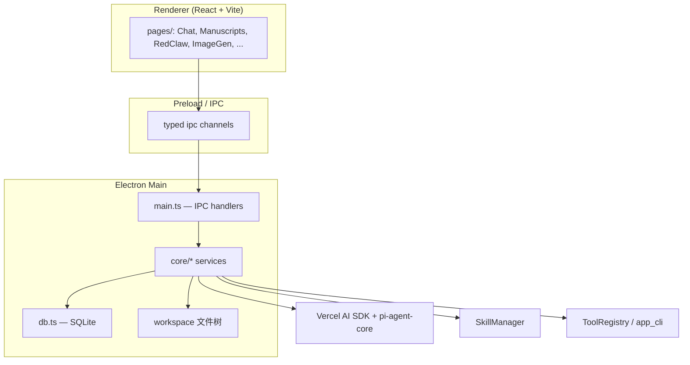
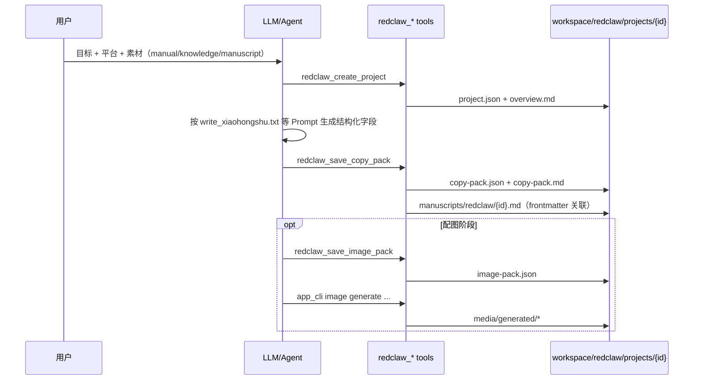
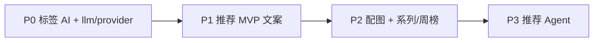

# RedBox 深度分析报告 — 面向 Project Pilot「GitHub 项目推荐」板块

> 文档版本：**v1.0**  
> 更新日期：2026-06-04  
> 信息来源：[Zread — Jamailar/RedBox](https://zread.ai/Jamailar/RedBox)、本地源码 `C:\Users\ly\Desktop\tmp\RedBox-main\RedBox-main`、Project Pilot 仓库现状  
> 关联文档：[PROJECT_PILOT_AI_Agent_接入分析.md](./PROJECT_PILOT_AI_Agent_接入分析.md)、[GithubStarsManager_竞品分析报告.md](./GithubStarsManager_竞品分析报告.md)、[PROJECT_PILOT_v0.1_设计文档.md](./PROJECT_PILOT_v0.1_设计文档.md)

---

## 1. 文档目的

本文回答三类问题，并给出可执行的借鉴路径：

1. **RedBox 是什么、结构如何** — 架构、模块、数据与 AI 运行时。  
2. **RedBox 如何与 AI 配合生成「单个创作项目」** — 从用户意图到文案/配图落盘的全链路。  
3. **Project Pilot 如何参考 RedBox 做「GitHub 项目推荐」板块** — 推荐文案、推荐图、单项目/系列推荐、周榜介绍等能力如何分期落地，以及哪些 Skill/模式能直接用、哪些不应照搬。

---

## 2. RedBox 产品定位（与 Project Pilot 的差异）

| 维度 | RedBox (RedConvert) | Project Pilot |
|------|---------------------|-----------------|
| **目标用户** | 小红书 / 公众号等内容创作者 | GitHub 项目收藏、发现、部署记录者 |
| **主界面** | Electron 桌面（生产 v1.9）+ Tauri 实验分支 LexBox | Web UI + 可选 Tauri 壳；**后端 FastAPI** |
| **内容对象** | 笔记、稿件、封面、短视频、知识条目 | GitHub 仓库元数据、标签、发现榜、笔记 |
| **AI 落点** | 写稿、生图、扩写、自动化发布闭环 | 标签归类（P0）、**推荐工作台**（中期）、长期 Agent |
| **项目理解** | 知识库 + 插件采集 + 向量检索 | **Zread / DeepWiki 外链**，不优先自建 README 分析 |
| **数据主权** | 全本地 workspace + SQLite | 本地 SQLite + 用户自备 LLM Key |

**结论：** RedBox 是「**创作 OS**」；Project Pilot 应学其 **生成 + 落盘 + 多版本草稿** 模式，而不是学其小红书采集、RedClaw 发布、主体库等垂直能力。

---

## 3. 仓库结构与架构分层

### 3.1 顶层布局

```
RedBox/
├── desktop/                 # 生产环境 Electron + React（v1.9）
│   ├── electron/            # 主进程：IPC、AI、DB、~80+ core 服务
│   │   ├── main.ts          # IPC 注册入口（体量极大，查通道时的「罗塞塔石碑」）
│   │   ├── db.ts            # better-sqlite3
│   │   ├── core/            # 业务服务层
│   │   ├── pi/              # Pi Agent 并行推理运行时
│   │   ├── prompts/         # Prompt 模板库（.txt）
│   │   ├── builtin-skills/  # 内置 Skill 包
│   │   └── system-skills/   # 系统级 Skill 包
│   ├── src/                 # React 页面（16+ 功能页，lazy load）
│   └── shared/              # 主进程/渲染进程共享类型
├── LexBox/                  # Tauri/Rust 迁移实验（v0.1，JSON 状态）
├── Plugin/                  # Chrome 扩展采集
└── images/、README.md、ROADMAP.md、AGENTS.md
```

### 3.2 经典桌面三层 + 服务层



**设计原则（`AGENTS.md`）：** 用户意图尽量由 **Skill + 系统 Prompt + 结构化元数据** 表达；工具层只做校验与安全约束，**避免**对用户消息做脆弱的关键词路由。

### 3.3 技术栈摘要

| 层 | 选型 |
|----|------|
| UI | React 18、Vite 5、Tailwind、CodeMirror 6、Xyflow |
| AI 抽象 | Vercel `ai` v6；已从 LangChain/LangGraph 迁至 **`@mariozechner/pi-agent-core`** |
| 持久化 | **better-sqlite3** + workspace 目录（稿件/媒体/RedClaw 项目） |
| 扩展 | Skill 目录、MCP Server、Chrome 插件 |

---

## 4. 功能模块地图（与推荐板块的映射）

| RedBox 功能 | 页面/服务 | 对 Project Pilot「推荐板块」的启示 |
|-------------|-----------|-----------------------------------|
| 知识库 | `Knowledge.tsx`、`IndexManager` | 对应 **资料库项目 + 用户笔记** 作为生成上下文，无需重做采集 |
| 漫步选题 | `wanderService` | 可类比 **从标签/周榜随机组合** 做「系列推荐」灵感，低优先 |
| 稿件工作台 | `Manuscripts.tsx` + `.redpost/.redarticle` | 对应 **推荐草稿编辑器**（Markdown/富文本） |
| 生图 | `imageGenerationService` + `imageProviderAdapters` | 对应 **推荐配图**；学适配器模式，非 Agent |
| 封面工作台 | `coverGenerationService` | 周榜/单项目 **卡片封面模板**，可二期 |
| RedClaw | `redclawStore` + tools | 对应 **结构化推荐包**（文案 JSON + 图 prompt + 版本） |
| 主体库 | `subjectsLibraryStore` | Project Pilot 用 **GitHub repo 元数据** 即可，不必做「人物/商品库」 |
| 媒体库 | `mediaLibraryStore` | 对应 **`recommend_assets` 表 + 文件或 URL** |
| 设置 | 多场景 model 映射 | 已有 **`/settings/ai` 多 Provider + scenario**，继续扩展 `recommend` 场景 |
| 发现/趋势 | —（RedBox 无 GitHub 趋势） | Project Pilot **已有** `discovery_trending` RSS + snapshot delta |

---

## 5. RedBox 如何与 AI 配合生成「单个项目/内容」

此处「单个项目」在 RedBox 中指 **一次 RedClaw 创作项目** 或 **一篇稿件包**；在 Project Pilot 中应对齐为 **一次「推荐草稿」绑定一个 `project_id`（或发现页临时 repo）**。

### 5.1 三种生成形态（由浅到深）

| 形态 | 入口 | 是否 tool loop | 典型落盘 |
|------|------|----------------|----------|
| **A. 单次 LLM** | Chat 直接回复、部分模板 | 否 | 仅聊天历史（SQLite `chat_messages`） |
| **B. 结构化任务 Prompt** | RedClaw 绑定 `platform` / `task_type` | 通常 1～N 轮，靠 Prompt 约束 | `copy-pack.json` + `copy-pack.md` + 稿件 symlink |
| **C. Agent + 工具** | PiChat / RedClaw Runner / `AgentExecutor` | 是（`QueryRuntime` + tools） | 同上 + `image-pack` + 媒体库资产 |

Project Pilot **阶段 1～3 应只做 A/B**；阶段 4 再评估 C。

### 5.2 RedClaw「单项目」标准闭环（最值得借鉴）

这是 RedBox 把「聊完就丢」变成「可编辑、可复盘资产」的核心机制。



**结构化元数据（创建项目时）：**

- `platform`: `xiaohongshu` | `wechat_official_account`  
- `taskType`: `direct_write` | `expand_from_xhs`  
- `sourceMode`: `manual` | `knowledge` | `manuscript`  
- 可选：`targetAudience`、`tone`、`sourceManuscriptPath` 等  

**文案包字段（`redclaw_save_copy_pack`）：**

- 小红书：`titleOptions`、`content`、`hashtags`、`coverTexts`、`publishPlan`  
- 公众号：额外 `summary`、`introduction`、`cta`、`imageSuggestions`  

对应 Project Pilot **单项目推荐** 可定义为：

```json
{
  "project_id": "uuid",
  "platform": "weibo | x | jike | markdown_blog",
  "title_options": ["..."],
  "hook": "一句话亮点",
  "body": "推荐正文",
  "tags": ["#开源", "#Rust"],
  "cover_texts": ["封面大字"],
  "cta": "链接或行动号召",
  "source": { "full_name": "owner/repo", "stars": 1200, "topics": [] }
}
```

### 5.3 Prompt 如何驱动「单篇」质量

RedBox 将平台写作约束放在 **`desktop/electron/prompts/library/`**，而非散落在 UI：

| 路径 | 用途 |
|------|------|
| `runtime/redclaw/write_xiaohongshu.txt` | 小红书闭环 + 必须 `save-copy` |
| `runtime/redclaw/write_wechat_article.txt` | 公众号长文 |
| `runtime/redclaw/expand_xhs_to_wechat.txt` | 一稿多平台扩写 |
| `personas/xiaohongshu_note.txt` | 语气与人设 |
| `templates/article_refine.txt` | 润色 |
| `runtime/pi/system_base.txt` | Agent 全局约束（含 RedClaw 落盘规则） |

**启示：** Project Pilot 应在 `backend/app/prompts/recommend/`（或等价目录）维护 **「单项目推荐 / 系列对比 / 周榜导读」** 三套模板，通过 `platform` 与 `recommend_kind` 路由，而不是在前端硬编码大段 Prompt。

### 5.4 Skill 在生成链中的角色

Skill 不是独立应用，而是 **注入系统 Prompt 的「能力边界说明书」**：

1. `SkillManager.discoverSkills()` 扫描 `builtin-skills/`、`system-skills/`、用户目录、`~/.claude/skills` 等。  
2. 用户消息含 `@skill名` 或匹配别名时 **`preactivateMentionedSkills`**。  
3. `buildDefaultSystemPrompt({ activatedSkillContent })` 拼进 Agent。  
4. 部分 Skill 声明 `allowed-tools: app_cli`，限制工具面。  

**与「生成单项目」直接相关的内置/系统 Skill：**

| Skill | 作用 | Project Pilot 是否可借鉴 |
|-------|------|---------------------------|
| `wechat-official-formatter` | 公众号结构、排版、发布约束 | **可改写**为「长文推荐 / 公众号导读」Skill |
| `redbox-video-director` | 短视频分镜 + 确认后再 `video generate` | 一般 **不需要**（除非做视频推荐） |
| `agent-persona-creator` | 生成 Advisor 人设 | 可选：「推荐号人设」 |
| `skill-creator` | 教 Agent 如何写新 Skill | 维护期工具，非 MVP |

Project Pilot **不必实现完整 Skill 文件系统**；MVP 用 **「场景模板 + Pydantic 输出 schema」** 即可达到 RedBox 阶段 B 的效果。待阶段 4 再考虑 Cursor 式 `SKILL.md` 热加载。

### 5.5 配图生成（非 Agent）

`generateImagesToMediaLibrary()` 流程：

1. 读 `settings` 中 `image_provider` / `image_provider_template` / endpoint / model。  
2. `imageProviderAdapters` 按模板调用（OpenAI Images、Gemini、DashScope Wan、Seedream、Midjourney 代理等）。  
3. 写入 `media/generated/`，并在 `media/catalog.json` 登记 `MediaAsset`。  
4. 可选 `boundManuscriptPath` 绑定稿件。  

**启示：** 推荐配图 = **「prompt 由 LLM 生成 → 图像 API 执行 → 资产表关联 draft_id」** 两步服务，与文案 Agent 解耦。

---

## 6. 存储体系详解

RedBox 采用 **「SQLite 索引 + 文件系统真相源」** 混合模式；Project Pilot 已具备 SQLite，推荐板块应延续 **表存元数据与关系，大文本/图片路径存文件或对象键**。

### 6.1 SQLite（`redconvert.db`）主要表

| 表/用途 | 内容 |
|---------|------|
| `settings` | API、多模型场景、图像/视频/MCP、代理 |
| `spaces` | 多工作空间隔离 |
| `chat_sessions` / `chat_messages` | 对话与 tool_calls |
| `knowledge_vectors` | 知识库向量 |
| `agent_tasks` / `agent_task_traces` | 长任务与追踪 |
| `manuscript_embeddings` / `manuscript_similarity_cache` | 稿件相似度缓存 |
| `archive_profiles` / `archive_samples` | 爆款样本库 |
| `wander_history` | 漫步历史 |
| `file_index_*` | 工作区文件索引 |

聊天与任务在库内；**成品稿件正文主要在文件系统**。

### 6.2 工作区目录（按 space）

`getWorkspacePaths()` 典型结构：

```
{workspace}/{spaceId}/
├── knowledge/          # 采集条目
├── manuscripts/        # 稿件树（.md / .redpost / .redarticle / …）
├── redclaw/projects/{rc_*}/
│   ├── project.json
│   ├── overview.md
│   ├── copy-pack.json / copy-pack.md
│   └── image-pack.json
├── media/
│   ├── catalog.json
│   ├── generated/
│   └── imported/
├── subjects/           # 主体库 catalog
└── advisors/ …
```

**稿件包类型（`shared/manuscriptFiles.ts`）：**

- `.md` — 普通文稿  
- `.redpost` — 小红书图文包  
- `.redarticle` — 长文  
- `.redvideo` / `.redaudio` — 音视频稿  

### 6.3 RedClaw 项目目录 = 「单创作项目」真相源

路径：`{workspace}/redclaw/projects/rc_{timestamp}_{slug}/`

| 文件 | 含义 |
|------|------|
| `project.json` | 平台、任务类型、来源、状态 `planning|drafted|reviewed` |
| `copy-pack.json` | 机器可读文案包 |
| `copy-pack.md` | 人类可读导出 |
| `image-pack.json` | 配图策略与 prompt 列表 |
| `manuscripts/redclaw/{id}.md` | 进入稿件工作台，带 gray-matter 元数据 |

### 6.4 WorkItem 看板

`workItemStore` 用 JSON 文件维护任务 DAG（`pending|active|waiting|done`），RedClaw 项目创建时可绑定 `workItemId`。这是 **「后台长任务 / 定时执行」** 的编排层，Project Pilot 若做「周榜定时生成导读」可参考，但 **非 MVP**。

---

## 7. Agent 运行时与工具体系（何时需要）

| 组件 | 职责 |
|------|------|
| `QueryRuntime` | tool loop、流式事件、超时 |
| `ToolRegistry` + `createBuiltinTools` | 按 `toolPack`（`redclaw` / `knowledge` / `chatroom`）注册工具 |
| `PiChatService` | 主会话 Agent，强制 RedClaw 落盘话术 |
| `intentRouter` / `roleRegistry` | 结构化路由（非关键词为主） |
| `mcpRuntime` | 外挂 MCP 工具 |

**RedClaw 相关工具（单项目生成关键）：**

- `redclaw_create_project`  
- `redclaw_save_copy_pack`  
- `redclaw_save_image_pack`  
- `redclaw_save_retrospective`  
- `app_cli` — 统一 CLI 门面（`redclaw save-copy`、`image generate`、`video generate` 等）  

**文件类工具：** `read` / `write` / `grep` / `workspace` / `explore_workspace` — 供 Agent 读知识库或稿件。  

Project Pilot 若做 Agent，应在 **FastAPI 侧** 实现少量工具：`list_library_projects`、`get_project_notes`、`save_recommend_draft`，而不是移植 Electron `main.ts` IPC。

---

## 8. Project Pilot：「GitHub 项目推荐」板块设计方案

以下与 [PROJECT_PILOT_AI_Agent_接入分析.md §5](./PROJECT_PILOT_AI_Agent_接入分析.md) 对齐，并补充 RedBox 级细节。

### 8.1 能力清单与用户故事

| 能力 | 说明 | RedBox 参照 | 建议阶段 |
|------|------|-------------|----------|
| **推荐文案生成** | 基于库内项目元数据 + 用户笔记 + 可选 Zread 链接 | `copy-pack` + Prompt 模板 | **P1 MVP** |
| **推荐图生成** | 封面/卡片图，多 Provider | `imageGenerationService` | **P2** |
| **单项目推荐** | 一篇一 repo，`recommend_kind=single` | RedClaw 单项目目录 | **P1** |
| **系列项目推荐** | 2～5 个 repo 对比、横评、清单体 | 多项目 RedClaw + 目录稿 | **P2** |
| **GitHub 周榜介绍** | 绑定 `discovery/trending?range=weekly` | 无直接对标；类似「编辑导读」 | **P2**（数据已有） |
| **平台语气预设** | 微博 / X / 公众号 / 笔记 | `personas/*` + `platform` 字段 | **P2** |
| **草稿历史与版本** | 编辑、复制、回滚 | `copy-pack.json` 版本字段或新 revision 表 | **P1～P2** |
| **Agent 工作流** | 选项目 → 写稿 → 生图 → 确认 | RedClaw Runner | **P4 长期** |

**明确不做（战略已定）：**

- 不用 LLM 替代 Zread 做 README 深度分析。  
- 不做 RedBox 式浏览器采集、公众号草稿发布、主体库。  

### 8.2 推荐板块信息架构（建议）

```
资料库 / 发现
    └── 「内容工厂」入口（/content-factory → /libraries/:id/content-factory）
            ├── 项目推广（P1 已交付）
            │     ├── 来源：资料库项目
            │     ├── 系列推荐 / 周榜导读（规划中）
            │     └── 平台：小红书 / 公众号 / X / LinkedIn
            ├── 编辑器（话术 + LLM generate-copy）
            ├── 配图 Tab（P1 UI 壳，P2 生图）
            └── 左侧草稿库列表
```

**周榜导读数据流（Project Pilot 已有优势）：**

```
GET /api/discovery/trending?range=weekly
    → discovery_snapshot 计算 rank/stars delta
    → LLM 输入：Top N 条目 + delta 摘要 + 用户 tone
    → 输出：周榜导语 + 逐条 one-liner（结构化 JSON）
    → 存 recommend_drafts（kind=weekly_digest）
```

### 8.3 数据模型（建议表）

| 表 | 字段要点 |
|----|----------|
| `recommend_drafts` | `id`, `library_id`, `kind`（single/series/weekly）, `platform`, `title`, `body_json`, `status`, `created_at` |
| `recommend_draft_projects` | `draft_id`, `project_id` 或 `discovery_full_name`, `sort_order`, `role`（主角/对比项） |
| `recommend_assets` | `draft_id`, `asset_type`（cover/card）, `prompt`, `storage_path` or `url` |

**与 RedBox 对齐的 JSON 包（存 `body_json` 或单独文件）：**

- `copy` — 同 RedBox `copy-pack` 字段子集  
- `image_pack` — 配图 prompt 列表（生成前即可保存）  

大文件（生成的 png）放 `backend/data/recommend_assets/` 或沿用 Tauri 资源目录策略，表内只存相对路径。

### 8.4 API 草案（FastAPI，契约优先）

| 方法 | 路径 | 说明 |
|------|------|------|
| POST | `/api/recommend/drafts` | 创建草稿 |
| GET | `/api/recommend/drafts` | 列表 |
| GET/PATCH | `/api/recommend/drafts/{id}` | 读/改 |
| POST | `/api/recommend/drafts/{id}/generate-copy` | LLM 生成（`services/recommend_copy.py`） |
| POST | `/api/recommend/drafts/{id}/generate-image` | 图像 API（P2） |
| POST | `/api/recommend/drafts/from-trending` | 从周榜快照创建 `weekly_digest` 草稿 |

生成接口应支持 **`preview_only`**（只返回 JSON 不写库），对齐 RedBox「先预览再 save」与标签 AI 的「先 suggest 再 apply」。

### 8.5 前端模块（React）

| 模块 | 参考 RedBox 页面 | Project Pilot 实现要点 |
|------|------------------|------------------------|
| 草稿列表 | Manuscripts 树 + 状态 | `pages/recommend/index.tsx` |
| 编辑区 | CodeMirror 稿件 | shadcn `Textarea` 或轻量 MD 编辑器 |
| 生成按钮 | RedClaw 面板 | 调 `generate-copy`，loading + 流式（可选 SSE） |
| 配图 | ImageGen | 展示 `recommend_assets` 缩略图 |
| 设置 | Settings AI 区 | 增加 scenario：`recommend_copy` / `recommend_image` |

### 8.6 LLM vs Agent 决策（再次确认）

| 场景 | 形态 |
|------|------|
| 单项目推荐文案 | **单次 LLM** + JSON schema |
| 系列对比 | **单次 LLM**（上下文批量 repo 元数据） |
| 周榜导读 | **单次 LLM**（输入 trending 列表） |
| 推荐配图 | **图像 API**（prompt 可由 LLM 先产） |
| 「从库里挑 3 个写横评并配图」 | **Agent + DB tools**（P4） |

共用已有 [`backend/app/services/llm/`](../backend/app/services/llm/) 与 [`settings_ai.py`](../backend/app/services/settings_ai.py)，**不要**引入 LangChain / pi-agent-core（Node 栈与 FastAPI 不匹配）。

---

## 9. 可从 RedBox 直接「借用」的模式清单

| 模式 | RedBox 实现 | Project Pilot 落地方式 |
|------|-------------|------------------------|
| 结构化创作包 | `copy-pack.json` + `.md` | `recommend_drafts.body_json` + 导出 MD |
| 平台维度字段 | `platform` / `taskType` | `platform` + `recommend_kind` |
| 生成必须落盘 | Prompt 要求 `save-copy` | API `apply` 或自动 PATCH draft |
| 图像多 Provider | `imageProviderAdapters` | `services/recommend_image.py` 适配器表 |
| 人工确认 | 视频 Skill 要求先确认分镜 | 文案/分类一律 preview |
| 场景化模型 | settings 多 model 字段 | 已有 `ai_scenarios_json`，加 `recommend` |
| 外链理解 | 知识库 URL | **Zread 链接进 Prompt**，不爬全文 |
| Skill 热加载 | `SkillManager` | 后期：`docs/skills/github-recommend-single.md` 拼 system prompt |
| WorkItem 定时 | `workItemStore` schedule | 周榜自动草稿（可选） |

**不建议照搬：**

- Electron `main.ts` 万行 IPC  
- 小红书/公众号发布与插件采集  
- 向量知识库全量重建（除非做语义搜库）  
- pi-agent-core 依赖（除非单独 Node sidecar，成本高）  

---

## 10. 分阶段实施路线图（与仓库 P0～P3 对齐）



| 阶段 | 交付物 | RedBox 参照点 |
|------|--------|---------------|
| **P0（进行中）** | `/settings/ai`、标签 suggest | `settings` 表多 Provider |
| **P1** | `recommend_drafts` + 单项目 `generate-copy` + 前端工作台 | `write_xiaohongshu` 结构、`save_copy_pack` 字段 |
| **P2** | `generate-image`、系列推荐、周榜 `from-trending` | `imageGenerationService`、`expand_*` 多平台 |
| **P3** | tool loop：查库 → 写稿 → 生图 | `AgentExecutor` + `app_cli` 思路，Python 自研 |

---

## 11. 附录

### 11.1 RedBox 内置 Skill 一览（截至分析日）

**builtin-skills/**

- `skill-creator` — 创建新 Skill 的元技能  
- `redbox-video-director` — 短视频分镜与 `wan2.7` 模型纪律  

**system-skills/**

- `wechat-official-formatter` — 公众号写作与排版  
- `agent-persona-creator` — Advisor 人设生成  

### 11.2 Prompt 库目录（节选）

- `library/runtime/redclaw/*` — 平台写作任务  
- `library/personas/*` — 小红书/YouTube 人设  
- `library/templates/*` — 提炼、润色、视频摘要  
- `library/runtime/ai/route_intent_*` — 意图路由（结构化）  

### 11.3 Project Pilot 已有、可复用到推荐板块的能力

| 能力 | 位置 |
|------|------|
| 发现 trending + delta | `discovery_trending.py`、`discovery_snapshot.py` |
| 项目 enrich | `discovery_enrich.py`、`github_enrich.py` |
| LLM 基础设施 | `services/llm/`、`settings_ai.py` |
| 标签 AI（预览→确认） | `tag_category_suggest.py`、前端 `tag-ai-suggest-dialog` |
| 产品规划 | `PROJECT_PILOT_AI_Agent_接入分析.md` §5 |

### 11.4 参考链接

- [RedBox Zread 文档](https://zread.ai/Jamailar/RedBox)  
- [RedBox GitHub](https://github.com/Jamailar/RedBox)  
- Project Pilot：[AI Agent 接入分析](./PROJECT_PILOT_AI_Agent_接入分析.md)  

---

## 12. 总结

1. **RedBox** 是本地化 **内容创作 OS**：SQLite 管索引与会话，**文件系统管成品**；RedClaw 用 **`project.json` + `copy-pack` + 稿件** 把 Agent 输出变成可编辑资产。  
2. **生成单个项目** 时，RedBox 优先用 **结构化 Prompt + 保存工具**（阶段 B），复杂场景才上 **Agent + app_cli**（阶段 C）。  
3. **Skill** 是 Prompt 能力包，内置 4 个；Project Pilot MVP 用 **模板 + JSON schema** 即可，不必先建 Skill 市场。  
4. **Project Pilot 推荐板块** 应站在已有 **资料库 + 发现周榜 + LLM Provider** 之上，做 **`recommend_drafts` 工作台**，分阶段补齐文案、配图、系列与周榜导读，Agent 放到最后。  

本文档随 RedBox 版本与 Project Pilot 实现进展可增量更新（建议 v1.1 在 P1 API 落地后补充 OpenAPI 路径与截图）。
